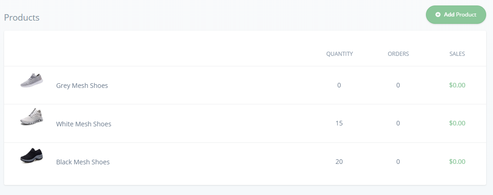
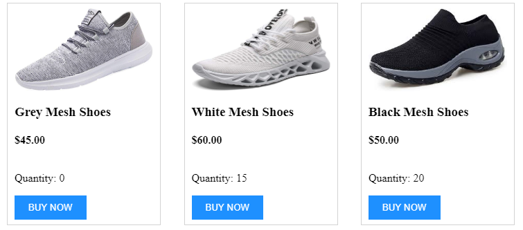

# How to list products in a catalog using the Commerce.js SDK
 
In this tutorial, we will use Commerce.js and the Chec dashboard to add products into our catalog, and then list them out on our eCommerce website. We will have the products listed out in a row complete with the product's name, image, price, quantity, and a link to buy the product. The design will be clean and simple so your customers will have an easy time browsing through each item.
 
We will be using React JS to create our eCommerce app where prior knowledge about states and lifecycle would come in handy although it will be briefly touched on later on in this tutorial.
 
Commerce.js version used in this project is 2.
 
The link below will take you a codesandbox IDE where you can quickly hop on a demo of the project.
 
[Live_Demo](https://codesandbox.io/s/ecommerce-playground-vp5m6)
 
## Overview
 
1. Create a Chec account to access the dashboard and get the API key
2. Installing Commerce.js and then connecting to it.
3. Fetch data with Commerce.js and then store it in state
4. Map out the products
 
5. Create styled item cards.
## Software and tools Requirements
 
1. IDE Code Editor
2. NPM or yarn
3. React JS
4. Styled_components
 
## Prerequisite knowledge
 
* Web Development basics such as CSS, HTML, and JS
 
## Installing React and Commerce.js
 
Before we install Commerece.js, lets install React. Create a new directory, pop open your terminal, and then run:
 
``` 
npx create-react-app app-name
cd app-name
npm start
```
 
We then install the ommerce.js SDK.
 
```
npm install @chec/commerce.js
```
 
And then import it into our App.js file
 
```
import Commerce from '@chec/commerce.js';
```
 
## Onwards to the Tutorial
 
Before we could get started, we must first create an account on [Chec.io](https://chec.io). As you're signing up, make sure you toggle the option to get your Commerce.js API keys so we can use them to have access to our account's products later.
 
### Add products into your store
 
On the navbar on the left side, you can find the products link. This is where you can add items into your catalog. I threw in three pair of shoes into the store as an example for our webpage's product listing.
 

 
### Getting access to the API with the SDK
 
Now it's time to grab our products through the react app. Remember when we activated our API keys? We will now be grabbing them from our Chec account. Go into Settings in the left navigation, and then into the developers tab. Here we have access to multiple API keys, but for early development purposes, we will use the "Sandbox Public Key"
 
Inside of your App.js file above our component, pass the key into our instantiation of a Commerce object using the new keyword. It should look like this:
 
```javascript
const commerce = new Commerce(
  "sandbox_public_key"
);
```
 
To verify that this works, we will pull our product data with the SDK, and then log them out to the console. Logging outputs is a good way to verify something is working, and you could also take a good look at what the object's values are to get familiar on how to use the data later. Below the commerce const, we type out:
 
```javascript
commerce.products.list().then((res) => {
    console.log(res.data));
}
```
 
Access the products property and then use the list method to return an array of all our products. Because we're making a call to the server, there will be a delay during the data fetching so we must chain on a then call, and pass in a callback function to deal with the returned data.
 
## Fetch and store data using React's useEffect and State
 
Due to React's reactive nature of rerendering based on state changes, we will need to use React Hooks useState and useEffect (React features for classless components). Starting off, we will import both useEffect and useState. The first Hooks we will go over is useState.
 
UseState basically creates a variable within the component. What's special about the state variables is that they will trigger a rerender of the component if the changes made on it will cause a change in the JSX. Here we create the state variable in our component.
 
```javascript
const [products, setProducts] = useState([]);
```
 
You place two variables in an const array, one for the state's value and one to set the state's value, and then assign it to the useState function. Passing in an argument into useState tells react that we want to initialize the state with this value. Next Hooks is useEffect.
 
Because the API call by Commerce.js is an [asynchronous](https://developer.mozilla.org/en-US/docs/Learn/JavaScript/Asynchronous/Concepts) action, we use useEffect to run the API call after the initial render of the page, and then the page rerenders again with the data included into the state. Your useEffect call will be within the component and could turn out like this.
 
```javascript
useEffect(() => {
    commerce.products.list().then(res => {
        setProducts(res.data);
    });
}, []);
```
 
A function is passed in as the first argument to tell React which function to activate when the page initially renders. The second argument is an empty array (aka dependency array) and it's there to have the useEffect call initialize once. The dependency array is important because useEffect will call everytime we set the state, which causes a rerender, which will then again set the state and then so on and so on... We will be locked into an infinite loop and our app will ultimately crash!
 
## Map out the products in our products state
 
We now have our product data stored in our web page’s state, now it's time to display them to our customers. Using the array method map, we can return each item onto the JSX. 
 
```javascript
<div>
    {products.map(product => (
        <p key={product.id}>{product.name}</p>
    ))}
</div>
```
As a way to quickly show this is working, I returned p tags with the product's name. You should see a result similar to this one:
 

 
### Create a styled item card to neatly list out products
 
We're almost done! We just need to show more details in a user friendly way. If you take a peek into the product's properties in the console, you'll find many details that you can reveal for your product. I will be using the name, image, quantity, and the purchase url to display the product's details.
 
We will first install styled-components, a styling library of my choice as it keeps all your relevant styling contained in your component, has a more true CSS syntax, and has dynamic prop passing.
 
```
npm install styled-components
```
 
I prepared most of the stylings for your convenience as styling is a fairly straight forward concept. My advice for you is play around with the styling to get a better feel, and then adjust them to your liking. Inside the app.js file, I made this styled component:
 
```javascript
const Container = styled.div`
  display: flex;
  justify-content: space-evenly;
  flex-wrap: wrap;
  max-width: 800px;
  margin: 0 auto;
`;
```
 
This creates a component named Container with the following styling properties. This container centers our product listings, and then spaces them evenly. You can then add the styled component into the jsx like any other component. It should replace the div we previously had.
 
 
```javascript
<Container>
    {products.map(product => (
    <ItemCard key={product.id} {...product} />
    ))}
</Container>
```
 
You'll notice that we will have an error and that's because I replaced the p tag with an ItemCard component, a component that we haven't quite made yet. Also note the {...product} within the component's tag. This "spreads" out all of the properties in our product into the component so we don't have to list them all out individually. We will now make the ItemCard Component.
 
I created a folder called components so we can store all the ItemCard components and other future components. I went ahead and made each styled component and then laid out the JSX. 
 
```javascript
 
import React from "react";
import styled from "styled-components";
 
const Card = styled.div`
  height: 300px;
  width: 200px;
  padding: 10px;
  border: 1px solid lightgray;
  display: flex;
  flex-direction: column;
  justify-content: space-evenly;
`;
 
const CardImg = styled.img`
  width: 100%;
  height: 120px;
`;
 
const BuyButton = styled.button`
  color: white;
  background: dodgerblue;
  border: none;
  padding: 10px 20px;
`;
 
const ItemCard = props => {
  return (
    <Card>
      <CardImg src={props.media.source} />
      <div>
        <h3>{props.name}</h3>
        <h4>{props.price.formatted_with_symbol}</h4>
      </div>
      <div>
        <p>Quantity: {props.quantity}</p>
        <a href={props.checkout_url.display}>
          <BuyButton>BUY NOW</BuyButton>
        </a>
      </div>
    </Card>
  );
};
 
export default ItemCard;
 
```
 
The main focus here should be on props, which is the data we passed down from our parent component (App.js) to our child component. This relationship implies that the ItemCard component is the child component.
 
We access props like we do with any object. When in doubt, you can console.log out props to better understand how to access prop’s values. Moving back to App.js, we import the ItemCard.js component and then we should get our products listed out!
 

 
Ta Da! We are finished, and now your products are finally listed in a customer friendly way. If you click the "Buy now" button, you'll be directed to the product's buy page. 
 
## The End... or is it?
 
More like the end of this tutorial that is, but the beginning to the endless amount of ideas that your eCommerce site could have. Using Commerce.js, we're able to list out your products and that's a good place to start! Thank you for following along, and best of luck!

